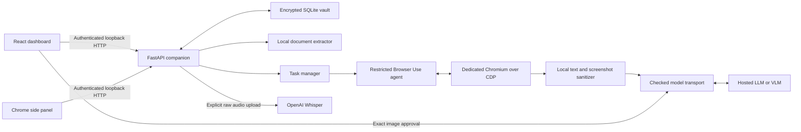
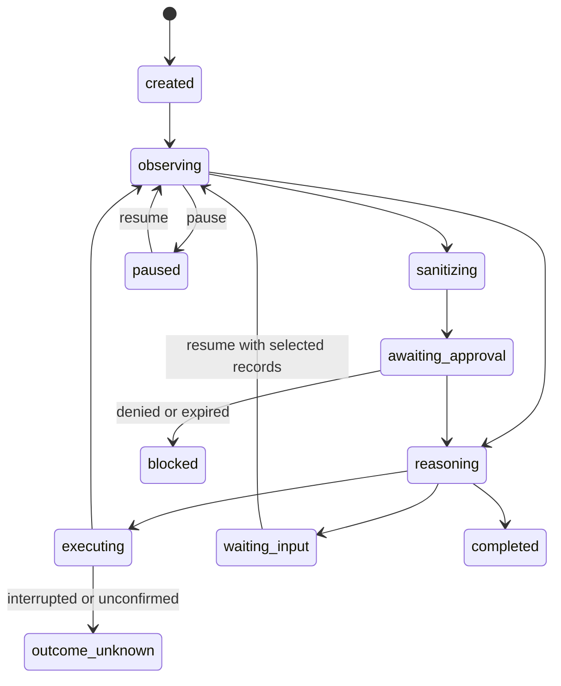

**Dev Privacy Guard — source-level project analysis and verified status, 11 September 2026**

This report describes the checkout at commit `bacc847` (`Updates`). It distinguishes implemented behavior, behavior exercised during this audit, limitations visible in the source, and future architecture. The application identifies itself as version 0.2.0. The analysis did not use a personal vault, record a real microphone, call a paid model, or submit a real application. Production application source was not changed. A dashboard build and synthetic tests were run.

**1. The actual product and its current status.** This is a substantial supervised browser-assistant prototype: a Python companion, React dashboard, Chrome extension, dedicated Chromium instance, encrypted facts/documents, local document extraction, restricted browser actions, hosted-model integration, and exact screenshot approval. Its strongest delivered contribution is the coordination of privacy filtering, reviewed facts, reference-based execution, and human supervision around Browser Use. The broader proposed product—browser-local learned vision, face detection, screenshot OCR, perception caching, and a measured evaluation dashboard—is incomplete.

It is essential to distinguish three different claims: “the mechanism is implemented,” “the mechanism passed a synthetic test,” and “the mechanism reliably solves arbitrary real websites.” The first two have substantial evidence here. The third does not follow from that evidence.

| Area | Implementation status | Evidence and practical interpretation |
|---|---|---|
| Local companion and dashboard hosting | Implemented | API and lifecycle tests pass; default app port 8765 and fixture port 8766. |
| Pairing and interface roles | Implemented | Origin checks, token binding, extension restrictions, expiry and invalid-input tests pass. |
| Encrypted vault | Implemented | Wrong passwords, tampering, row swapping, versions, lock, document storage and transactions tested. |
| Profile CRUD | Implemented | Reviewed records are stored encrypted; dashboard receives decrypted values when unlocked. |
| Document extraction | Implemented within bounded formats | TXT/CSV, PDF text, image OCR and invalid inputs tested; no general financial document understanding. |
| Decimal calculations | Implemented | Exact explicit summation; currency/period ownership remain user decisions. |
| Deterministic demo planner | Implemented and demonstrated | Six actual browser fields filled; submit and no-submit scenarios passed. |
| Native Browser Use agent | Implemented and exercised | Real Chromium and native Agent with simulated hosted responses pass navigation, references, image review and resume. |
| Live Gemini/OpenAI reasoning quality | Not established in this audit | Provider transport is mocked in tests. No credential or paid call was used. |
| Text privacy filter | Implemented, heuristic | Known-value/encoding/pattern regressions pass; universal PII recall is not measured. |
| Selective screenshot masking | Implemented | DOM rules, opaque pixels, geometry checks and immutable artifacts tested. |
| Manual screenshot approval | Implemented | Image coordinates, changed approval IDs and required refreshed previews tested. |
| Browser-local ViT/CV | Not implemented | No learned browser vision inference pipeline or trained detector artifacts in runtime. |
| Face detection / screenshot OCR | Not implemented | Images/media are covered conservatively. Document OCR is a separate implemented feature. |
| Voice recording and Whisper transport | Implemented | Synthetic microphone and mocked transcription tests pass. Audio is explicitly unredacted. |
| Pause/resume/stop | Implemented with limits | Same-process runtime can resume; restarts stop historical unfinished tasks. |
| Arbitrary site compatibility | Partial | Standard HTML, same-origin frames and open shadow roots tested; custom applications require caution. |
| Final-action policy | Partial / inconsistent | Remote path has a heuristic gate; demo ignores the separate stop-before-submit Boolean. |
| One-active-task invariant | Incomplete under concurrent starts | Isolated admission probe accepted two simultaneous starts. |
| Evaluation/benchmark dashboard | Not implemented | Counts, timeline and some task metrics exist; no measured detector benchmark UI. |
| Packaging | Source-based prototype | Setup/start scripts; no signed installer, store distribution or CI workflow found. |

**2. Checks performed during this audit.** The baseline command `.venv/bin/python -m pytest -q` produced **197 passed, 6 skipped in 18.47 seconds**. The skipped cases were the opt-in real-browser integrations. The expanded command `GUARD_BROWSER_TESTS=1 .venv/bin/python -m pytest tests apps/dashboard/tests apps/extension/tests -q --tb=short` produced **208 passed in 39.32 seconds**, with no skips. The first browser attempt was prevented by the execution sandbox; rerunning outside that sandbox allowed Chromium to launch and all cases passed. Those launch failures were environmental, not evidence that the application failed its browser assertions.

Ruff passed. `npm --prefix apps/dashboard run build` passed strict TypeScript checking and Vite bundling. JavaScript syntax checks passed for the extension background, side panel, recording page, and both demo scripts. The build produced an approximately 274.56 kB JavaScript bundle and 37.18 kB CSS bundle, approximately 82.24 kB and 8.90 kB gzip respectively. These are bundle sizes, not runtime memory measurements.

| Shipped-demo smoke result | Submit scenario | Stop-before-submitting wording |
|---|---:|---:|
| Actual fields verified | 6 | 6 |
| Sanitized requests checked | 9 | 7 |
| Context approvals | 9 | 7 |
| Private disclosure approvals | 6 | 6 |
| Submit/click approvals | 1 | 0 |
| Actual synthetic submission events | 1 | 0 |
| Remote model requests | 0 | 0 |
| Temporary vault plaintext check | Passed | Passed |

These smoke scripts approve synthetic requests programmatically for testing; the product UI requires its user's approvals. The script's submit scenario omits the Boolean flag, so it receives the schema default `stop_before_submit=True` yet still submits after a click approval. This independently exposes the demo policy inconsistency; it is not evidence of an unapproved click.

Additional disposable probes established that an API pairing request with origin `http://127.0.0.1:5173` is rejected with HTTP 403, two concurrent starts can both pass admission, and an initially selected `http://192.168.1.10/form` target is accepted by the start policy. That last probe used a fake tab and made no network request. A listener check found no companion listening on default port 8765 at the time checked; this says nothing about a service on a custom port. The user's actual saved provider configuration and vault contents were not inspected.

**3. Repository map and responsibility boundaries.** There are 17 application Python modules totaling 4,956 lines, 14 root Python test files, a 2,926-line dashboard `App.tsx`, a 2,809-line dashboard stylesheet, separate voice/image React components, and native JavaScript extension surfaces. Line count measures size, not correctness or completion.

| File or directory | Actual responsibility |
|---|---|
| `privacy_guard/__init__.py` | Package version. |
| `privacy_guard/config.py` | Paths, ports, provider defaults, early telemetry environment settings. |
| `privacy_guard/main.py` | Process entry point, logging, port reservation, two Uvicorn servers, shutdown. |
| `privacy_guard/api.py` | Authentication middleware, HTTP routes, document upload, settings and frontend hosting. |
| `privacy_guard/models.py` | Pydantic request and legacy action schemas. |
| `privacy_guard/vault.py` | Passphrase-derived encryption, SQLite persistence, records/documents/blobs and transactions. |
| `privacy_guard/documents.py` | Format validation, PDF extraction/rendering, Tesseract OCR, candidates and decimal sums. |
| `privacy_guard/audio.py` | Bounded raw-audio upload to fixed Whisper endpoint. |
| `privacy_guard/privacy.py` | Known-value and pattern text sanitization; legacy fully black screenshot path. |
| `privacy_guard/privacy_geometry.py` | Browser-side privacy rectangle collection and CSS-to-image rectangle conversion. |
| `privacy_guard/screenshots.py` | Pixel redaction, canonical metadata-free PNGs and registered immutable artifacts. |
| `privacy_guard/browser.py` | Owned Chromium process, CDP, isolated-world observations, guarded execution and teardown. |
| `privacy_guard/tasks.py` | Task admission, state, records/references, approvals, lifecycle and legacy planner loop. |
| `privacy_guard/gateway.py` | Canonical request hashing, endpoint checks and deterministic/legacy model gateway. |
| `privacy_guard/agent_llm.py` | Native-agent message replacement/sanitization, checked HTTP transport and fallback. |
| `privacy_guard/agent_runtime.py` | Restricted native Agent subclass, tool registry, execution policy and visual checkpoints. |
| `privacy_guard/diagnostics.py` | Structured request/task/operation logs excluding exception messages and payloads. |
| `apps/dashboard/src/` | User-facing management, task entry, activity, documents, voice and image review. |
| `apps/extension/` | Manifest V3 side panel and recording tab; no Python or local CV runs here. |
| `demo/` | Two fictional HTML workflows and synthetic documents. |
| `scripts/` | Installation, startup, verification and browser smoke harness. |
| `tests/` | Backend, policy, transport and real-browser regression tests. |
| `docs/`, root plans | Current/historical implementation records and future design. |
| `output/paper/` | Research manuscripts, compiled PDFs, ZIPs and compiler logs—not runtime code. |

Installed versions observed: Python dependencies include Browser Use 0.13.10, FastAPI 0.141.1, Uvicorn 0.52.4, cryptography 48.0.1, pypdf 6.16.2, pypdfium2 5.13.0, Pillow 12.3.0, HTTPX 0.28.1, Playwright 1.62.0 and pytest 9.1.1. Frontend dependencies include React/React DOM 19.2.8, TypeScript 5.7.3, Vite 6.4.3 and lucide-react 0.468.0. These are the local installed versions, not a claim that they are the latest available. The project allows Python >=3.12,<3.14; this environment uses Python 3.12. Browser Use is explicitly pinned because the project subclasses and overrides several upstream internals.

**4. The process and network architecture.** There are several distinct trust domains: dashboard JavaScript, extension JavaScript, the Python companion, the controlled website renderer, local encrypted storage, and hosted reasoning/transcription providers. The Python service owns the sensitive coordination. A dashboard button is an HTTP request, not a direct vault write or browser action. The extension is a client of that same API, not the browser automation engine.



The default companion origin is `http://127.0.0.1:8765`. The synthetic portal is served separately at `http://127.0.0.1:8766`. Chromium also exposes an ephemeral loopback debugging port and WebSocket. These are different protocols/endpoints: the app uses ordinary HTTP JSON; CDP carries browser-control commands; providers receive HTTPS requests. The destination website has its own network behavior, which is not routed through the model sanitizer.

The data directory defaults to `~/Library/Application Support/Dev Privacy Guard`, with `GUARD_DATA_DIR` as an override. It contains the encrypted database, a dedicated browser profile, installed Chromium files, and diagnostic logs. Browser cookies/cache are ordinary Chromium profile data; they do not become AES-GCM encrypted just because the vault is encrypted.

**5. Startup, installation and shutdown in execution order.** `scripts/setup.sh` requires `uv`, `node`, `npm` and `tesseract`; runs `uv sync --frozen`; runs frontend `npm ci` and a production build; then installs Playwright Chromium into the application browser directory. The lock files support reproducible dependency installation. Tesseract is an external executable, not supplied merely by installing the Python OCR package.

`scripts/start.sh` changes to the repository, verifies `.venv/bin/python` and the built frontend entry exist, and replaces the shell process with `python -m privacy_guard.main`. It does not install dependencies, rebuild modified TSX, or run tests. Therefore changing frontend source and only restarting can serve an old build. Python code changes require a process restart because the normal launch is not an autoreloading development server.

`main()` sets a restrictive umask and initializes diagnostics. `serve()` validates distinct valid ports and checks for `dist/index.html`. It reserves both loopback listening sockets before creating the app and announcing pairing. This reduces half-started operation where one UI port works and the other has failed. It constructs two Uvicorn servers, one for the API/dashboard and one for static demo files. Shared SIGINT/SIGTERM handlers set both servers' exit flags. If either server stops, the other is stopped and both outcomes are collected.

On API lifespan exit, active task work is stopped, the owned browser is shut down, transcription is cleared and the vault key is discarded. Browser teardown has bounded waits and terminates only the process that this driver launched. It does not search for and kill arbitrary Chrome processes. Dedicated-profile cache files remain; “shutdown” is not “erase browser history.”

**6. HTTP schemas and API contract.** Pydantic models use `extra="forbid"`, so unknown fields are rejected rather than silently becoming part of trusted input. This is important for malicious action objects attempting to include a literal value or a forged `_approved` field. Validation failures return a generic 422 response instead of Pydantic's input-echoing default.

| Endpoint under `/api/v1` | Purpose | Important behavior |
|---|---|---|
| `POST /pair` | Exchange pairing code for a session token | Rate limited; token bound to interface origin/role. |
| `GET /status` | Current lock/browser/provider/task summary | `configured` means key/model present, not provider health. |
| `POST /vault/initialize` | Create encrypted vault | One-time initialization. |
| `POST /vault/unlock` | Derive key and restore configuration/history | Historical unfinished tasks become stopped. |
| `POST /vault/lock` | Revoke active work and clear private runtime access | Does not close or clear website fields. |
| `GET/POST /records` | Read full local records / create or edit | Dashboard role only. |
| `DELETE /records/{id}` | Delete record | Old references then fail resolution. |
| `GET /record-catalog` | Labels/types/scopes/IDs without values | Extension can use this. |
| `GET/POST /documents` | List documents/candidates / bounded upload | Upload itself does not approve facts. |
| `POST /documents/{id}/review` | Atomically confirm selected candidates | One review checkpoint; subsequent edits use records. |
| `DELETE /documents/{id}` | Remove original and extraction | Confirmed records remain. |
| `POST /calculations/sum` | Sum selected reviewed amount records | Creates a new calculation-scope record. |
| `GET/POST /settings` | Read safe settings / store credentials | Keys never returned by GET. |
| `POST /audio/transcribe` | Send explicit recording to Whisper | Raw audio body; returns a draft only. |
| `POST /browser/launch` | Launch or reuse owned browser | No arbitrary personal browser attachment. |
| `GET /browser/tabs` | Enumerate owned page targets | Includes URLs/titles; excludes extension pages. |
| `POST /browser/demo` | Open original fixture | Dedicated browser. |
| `POST /browser/portal` | Open Meridian portal | Dedicated browser. |
| `POST /demo/seed` | Save synthetic records | `partial=true` chooses contact subset; skips existing labels. |
| `GET/POST /tasks` | List task history / create task | One-active-worker check has a concurrency gap. |
| `GET /tasks/{id}` | Task, latest request, events, pending approval | Public task fields omit underscore-prefixed runtime state. |
| `POST /tasks/{id}/control` | Pause/resume/stop | Resume can replace selected record IDs. |
| `POST /tasks/{id}/approve` | Resolve pending decision | Current ID and expiry required. |
| `GET /tasks/{id}/image-preview` | Original/redacted local preview | Dashboard only. |
| `POST /tasks/{id}/masks` | Add image masks | Replaces artifact/request approval identity. |
| `GET /schema` | Authenticated OpenAPI schema | Public `/docs` and `/openapi.json` are disabled. |

`GET /health` is public and reports service/version. Assets are served under `/assets`; other non-API GET paths return the frontend entry. Unknown API GET paths receive 404. Typical errors are 400 for safe application validation, 401 for unpaired/expired sessions, 403 for origin/role policy, 413 for bounded uploads, 422 for invalid schemas, and 423 for a locked vault. Unexpected errors use a generic 500 message with a request ID.

**7. Pairing, CORS, CSP and permissions.** The pairing code is generated with `secrets.token_urlsafe(12)`, expires after 30 minutes, and has a global maximum of ten attempts in a moving minute. Successful pairing returns `token_urlsafe(32)`, valid for twelve hours in an in-memory session dictionary. Restarting destroys sessions and generates a new code.

The middleware checks the HTTP Host against loopback names, checks Origin against the dashboard origins or a syntactically valid Chrome extension ID, and checks bearer-token origin binding. Chrome extension requests also send `X-Guard-Origin`. A supplied identity header cannot contradict a real Origin header. Because browser extensions may omit Origin, this extra header supports their local calls. It is interface identification, not a cryptographic attestation of installed code; pairing remains the authorization step. A paired dashboard's same-origin GET can omit Origin if `Sec-Fetch-Site: same-origin` supplies the expected browser context.

The extension cannot manage vault records, documents, calculations, lock/unlock, private screenshot previews, mask edits or settings changes. It can request tasks, selected record catalogs and audio transcription. It cannot approve image transmission through the API—even denial through that same image approval endpoint is blocked for the extension role. Consequently its visible image “Deny” control currently receives a 403; actual image decisions must occur in the dashboard.

CORS controls which browser origins may use the local API; it is not authentication by itself. The bearer token is the authentication credential. CSP controls what the served dashboard can execute/load: same-origin scripts, same-origin connections, local/data images, blob audio, no plugin objects and no embedding by other frames. Inline styles are permitted for the visual UI. `Cache-Control: no-store`, `nosniff` and `no-referrer` are set on the normal response path. These controls reduce ordinary browser attack paths, but do not protect against trusted-context XSS, a compromised local machine or an attacker who possesses the paired token and matching request authority.

There is no account server, multi-user RBAC system, refresh-token protocol, passphrase recovery or server-side logout endpoint. “Disconnect/unpair” removes a client token; it does not explicitly revoke every copy on the server or lock the vault. Pairing expiry and vault lock are different concepts.

**8. The dashboard from HTML to rendered UI.** `apps/dashboard/index.html` contains metadata, an empty `<div id="root">`, and the module entry. In development Vite processes `src/main.tsx`; in the production build the entry becomes bundled asset references. `main.tsx` calls `createRoot(...).render(<React.StrictMode><App /></React.StrictMode>)` and imports the stylesheet.

React renders by calling components to determine the desired element structure, then commits necessary DOM changes. A state update can trigger another render without replacing the entire document. The browser then displays the resulting DOM. This distinction explains why a two-second status poll need not reload the page. [React render and commit](https://react.dev/learn/render-and-commit)

`App` owns pairing state, companion status, selected page, records, documents, tasks, selected task, notices, errors, current busy operation and the task modal. `useState` is for values affecting render. `useRef` retains identities such as a selected task ID without itself scheduling a render. `useEffect` manages subscriptions and timers. `useCallback` keeps the loader function stable for effect dependencies. Controlled text fields use a `value` prop and an `onChange` state setter; the component state is their source of truth.

`api.ts` centralizes `fetch('/api/v1' + path)`, the bearer token and error handling. The token is held in `sessionStorage` under `dpg.session`; this is per-origin browser-tab storage rather than vault encryption. It survives an ordinary reload in that tab. HTTP 401 clears it and dispatches a custom `dpg:unpaired` event. App listens for that event and clears loaded state. `FormData` uploads omit an explicit JSON content type so the browser can generate the multipart boundary. Audio supplies its MIME explicitly.

The initial full load reads status and, when unlocked, full records/documents plus task history. Thereafter a two-second timer polls status and the selected task. It is polling, not WebSocket/SSE streaming. Closing the dashboard removes its timer but does not own or cancel the companion worker. Full reloads after successful mutations refresh lists. The extension separately polls the same server.

There is a small manual hash router: `#page=documents`, `#page=activity&task=...`, and `&new=1` support incoming links. Navigation updates component state and `history.replaceState`; there is no React Router dependency or complete `hashchange`/back-stack synchronization. The dashboard poll has no in-flight guard or abort controller, so slow responses can overlap and stale responses can arrive after newer state.

**9. Every major dashboard screen.** Overview displays real counts of loaded records, documents and completed historical tasks, browser state and a current-task summary. The decorative `ref_01`/`ref_02` illustration is static artwork; it is not an actual emitted reference catalog. “Privacy boundary active” is a fixed presentation label, not a dynamic audit result or leak detector.

Personal vault provides label/type search, masked-by-default table display, reveal/hide, add/edit/delete, scope/source presentation and a calculation dialog. Masking the table is a presentation choice: decrypted values already exist in the authenticated dashboard's JavaScript memory. It should not be described as protection from that dashboard itself. Record edits replace encrypted payloads and increment version numbers.

Documents accepts a file picker or drag/drop, uploads one file, and opens editable extracted candidates. Newly displayed candidates are unchecked by default in the UI, despite the backend candidate schema defaulting `selected=True` when a client omits it. Users can edit labels and values and choose document/profile/task scope. The UI does not expose candidate `field_type` editing in that review dialog. Confirmed records can subsequently be edited in the vault. The library can reopen unreviewed extraction; it is not a full embedded PDF/image viewer or original-file download interface.

Task activity displays state, step, approvals, result/error, a timeline and the latest sanitized request. There is no complete durable log of every raw model response, video replay or token-cost chart. Resume opens a selection dialog. Its initial checked selection is profile records, not necessarily the task's previous exact subset; users must review the selection before resuming. This is visible reauthorization, but an easy source of unintentionally broader selection.

Settings shows the browser, reasoning model/base URL, primary key, separate fallback model/key and separate Whisper key. GET never returns stored keys. Blank UI key input preserves an existing key. A fallback removal control sends null. Primary/Whisper key deletion is supported by suitable API input but is not equivalently exposed as an explicit UI removal flow. Saving a reasoning “mode” preference does not fully control new-task mode: the task modal initially chooses remote when a provider is configured, otherwise demo.

New task collects goal, optional URL/exact existing target, selected records, reasoning mode, visual checkpoints, text-review choice and stop-before-submission. UI defaults differ from the raw API defaults: the dashboard enables remote visual checkpoints, whereas `TaskRequest.vision` defaults to false. A URL can also be inferred from a goal if no explicit target exists. “Prepare portal demo” creates only synthetic contact records and preselects those labels; it is not an agent run. Existing records with matching labels are retained, so the preparation routine does not guarantee that those labels currently contain synthetic values.

Modals use dialog semantics, an Escape handler, a keyboard Tab loop, focus restoration and a temporary body scroll lock. Numeric screenshot-mask controls provide an alternative to drawing. CSS uses custom properties, Grid/Flexbox, a fixed sidebar, constrained overflow, mobile breakpoints and reduced-motion overrides. The font stack starts with Inter but does not download it; the installed/system fallback is used if unavailable. There is no CDN font request in the shipped styling.

**10. What the DOM actually is.** The DOM is the browser's in-memory tree of document objects. An HTML element is an object with properties, attributes, parent/child relationships and event behavior. JavaScript operates on that live tree through browser APIs. The source HTML is an input representation; the live DOM can differ after parsing and script execution. The DOM is not itself a screenshot, an AI model, or part of JavaScript's core language. [MDN DOM reference](https://developer.mozilla.org/en-US/docs/Web/API/Document_Object_Model)

For the project's form, an illustrative subtree is:

```text
Document
└── html
    ├── head
    │   └── title
    └── body
        └── form
            ├── label
            │   ├── Text("Full name")
            │   └── input
            └── button
                └── Text("Continue to review")
```

The visible words are often separate Text nodes. `input.value` is the live form value and need not be equal to the literal `value` attribute in the original markup. `textContent` reads node text; `innerText` reflects rendered textual content more closely; neither is a universal description of every visible pixel. An image, canvas or generated CSS content can show information without corresponding ordinary text nodes. This is precisely why the privacy pipeline combines text inspection with conservative media masking and blocks certain unsupported geometry.

CSS determines visibility, layout, size and placement. The renderer calculates boxes and paints them to pixels; compositing can move some visual layers without changing the DOM tree. The same element can occupy different positions after scrolling, resizing, loading fonts or running animations. Consequently “I found the sensitive text” is not sufficient to prove that a previously calculated rectangle still covers its current pixels.

The project uses the DOM in three different ways: React updates its own dashboard tree; the extension directly creates/updates its own panel tree; and companion-controlled JavaScript inspects/manipulates the target website tree. These are separate documents and execution contexts. The extension does not gain direct access to dashboard memory or every website DOM merely by displaying a side panel.

**11. How the companion reads website DOM through CDP.** Chrome DevTools Protocol provides commands over the browser debugging connection. A `target_id` identifies one exact browser target. Two tabs with identical URLs still have different target IDs. This avoids accidentally filling whichever same-URL page happens to be most recent.

`BrowserDriver._context()` locates the selected target, gets its main frame, and creates an isolated JavaScript world named `privacy-guard-local`. The project's `__privacyGuard` bookkeeping lives in that world. Isolated worlds separate JavaScript global environments while interacting with the same underlying document; they do not make filled DOM values invisible to the page. [Chrome explanation of isolated worlds](https://developer.chrome.com/docs/extensions/develop/concepts/content-scripts)

`Runtime.callFunctionOn` invokes fixed, application-owned functions with structured arguments, `returnByValue=True`, and a fifteen-second boundary. The LLM is not allowed to provide arbitrary JavaScript. A private value crosses this local CDP boundary as an argument only after local reference resolution. The fixed observer/executor source is trusted code; page content remains untrusted data.

The observer keeps a nonce, revision counter, observation serial, node array, root observers and supported frame-document identities. It traverses the top document, open shadow roots and inspectable frames whose origin equals the top-level origin. It stops at 12,000 inspected elements and 2,000 exposed controls. Candidate controls include native inputs, textareas, selects, buttons, anchors and selected ARIA roles such as button, checkbox, radio, option and combobox. A general `contenteditable` editor is not a supported literal-input target.

It checks positive box size, display and visibility, skips hidden inputs, and infers labels from associated labels, `aria-labelledby`, `aria-label`, placeholder, text, name or ID. This is a useful local approximation, not the complete browser accessible-name algorithm. It records native select options, excluding disabled choices at execution time; observation itself includes disabled state. Only the first 150 options are observed. It records raw metadata locally, including required/readonly/disabled flags, field values, rectangles, submit classification and link destinations.

Each local index is `s.nodes.push(element)`, so it is one-based and refers to an actual element object in that observation. It is not a stable website ID or an upstream Browser Use index. The model sees sanitized local indices. The helper for mapping upstream backend-node IDs exists in `browser.py`, but the current remote transport replaces native state with local indices instead of relying on that helper.

**12. Mutation tracking, stale observations and the event loop.** A MutationObserver can report changes to children, attributes and text throughout an observed subtree. The project registers such observers and also input/change/scroll/resize listeners, because form/property changes and geometry movement are not equivalent to structural mutations. [MDN MutationObserver](https://developer.mozilla.org/en-US/docs/Web/API/MutationObserver)

Every observation serializes an epoch of the form `nonce:revision:serial`. Nonce distinguishes document/world lifetime; revision records noticed changes; serial distinguishes successive observations even without a mutation. The executor drains pending mutation records before comparing epochs. It also checks URL/origin and whether inspected frame elements still point to the same document. Navigating an iframe replaces its document object, so a reference into the old frame cannot silently remain valid.

Validation and DOM dispatch run synchronously in one renderer function. Ordinary queued JavaScript does not run as a separate task between the epoch check and the next statement. However, the dispatched input/change/click events can invoke page handlers synchronously within that function, and the page can schedule later asynchronous work. The code checks immediate acceptance of values and select identity; it cannot prove that a later server validation, timer or SPA rerender will keep the result.

Mutation tracking is deliberately conservative: an unrelated ticking page element can invalidate a plan and cause fresh observations. It is also not omniscient: a site that changes properties without events, an unsupported visual behavior, or a change after an immediate verification can escape that particular revision mechanism. The screenshot path adds further geometry/animation checks; it does not turn the epoch into a cryptographic commitment to every future page behavior.

**13. Precisely how an input is filled.** The LLM emits an action such as `input_ref(index=4, value_ref="ref_ab12cd34")`. Locally the task maps the reference to an existing record ID/version; the type compatibility gate rejects clear mismatches and prohibited field types. The browser driver confirms that the caller's observation matches its cached epoch and exact target, checks the action shape and cancellation generation, and calls the fixed renderer executor.

The executor retrieves `s.nodes[index - 1]`, checks that it remains connected, enabled, writable and visible, then accepts only supported native text-like inputs or textareas. It obtains the native value setter from the target element's own document/window prototype and calls it with the actual private string. Using the owner document matters for same-origin frame elements, whose constructors belong to a different JavaScript realm.

It dispatches bubbling `input` and `change` events and compares the resulting `e.value` to the supplied value. Those events inform page JavaScript/frameworks of the edit. They are programmatically generated events; the project does not simulate every trusted physical keystroke. Widgets requiring trusted user interaction or a different event sequence may fail or need manual operation. The result returned to the model says only that the action was confirmed locally; it does not return the value.

The website can read `e.value` during its event handler and send it elsewhere immediately. “Stop before submit” prevents only certain final actions; it does not undo the disclosure caused by filling. The project's privacy boundary principally minimizes data sent to the reasoning provider, while user-selected fields are deliberately disclosed to the task website.

**14. Dropdowns, clicks, scrolling and readiness.** For native single-select controls, reference selection first matches exact option value or label. If no match exists, it normalizes NFKC, whitespace and case and tries again. Multiple matches are rejected rather than taking the first. Disabled options and disabled optgroups are excluded. A separate `select_option` action selects a zero-based observed option index after human approval, allowing two labels to share a backend value. The executor uses the native `selectedIndex` setter, emits events, and checks that the same option object remains selected afterward. Multiselect is unsupported.

Dropdown rejections such as missing/ambiguous/disabled choice are treated as pre-change recoverable results in the remote path. The agent can observe fresh choices or ask for information. A site changing the selected identity after events is an uncertain outcome, because something already happened. These are meaningfully different errors.

Clicks require a coordinator-provided approval Boolean at the driver layer. The remote coordinator can grant it automatically for ordinary anchors, after applying its own risk/destination logic; therefore the low-level flag is not proof that a user clicked an approval button for every anchor. The renderer rejects disallowed cross-origin link/form targets, scrolls the element into view, checks the center hit target, forces anchors into the same task tab, then invokes `.click()`.

An element-center test handles some overlapping controls but is not full visibility verification through every ancestor frame, clipping path or custom widget. Native inputs are set through properties; they do not receive the same full hit-test path as clicks. Frame rectangles in the local text observer are in the frame's own viewport coordinates, a further limitation when interpreting global geometry. The screenshot collector conservatively masks entire frame regions instead of exposing their contents.

Scroll is bounded to approximately a few pages and +/-2,000 pixels at the driver. Wait is bounded to three seconds in the remote tool. Startup waits up to twenty seconds for the exact target to have a body, a document state beyond `loading`, and the same ready URL on consecutive checks. It intentionally does not wait for network idle. This handles initial redirects but does not establish that a long-running SPA has finished rendering all future content.

**15. Task creation, references and records.** A task can start from an explicit URL, an exact selected controlled target, or a URL extracted from its goal. It gets a random ID, sanitized public goal, target, destination, timestamps, step and event list. Private fields prefixed with `_` contain the original goal, origin, policies, selected record IDs, runtime history and reference mappings. Public serialization excludes those underscore-prefixed fields.

A reviewed record is a local data object with ID, label, type, value, version, source, scope, reviewed flag and timestamp. Its ID is not its model reference. For each authorized record the task creates a short opaque `ref_` plus eight hex characters. The binding contains record ID and current version; the outgoing catalog contains only reference ID, sanitized label and type. These references are indirection, not encryption or cryptographic secret sharing.

If selection is omitted, only reviewed profile-scope records enter the catalog. An explicit empty list authorizes no records. Explicit IDs can authorize reviewed document/calculation/task-labeled records as well. The `scope` string is largely organizational plus a default-selection filter: a record with scope `task` is still persisted and can be explicitly selected later; it is not automatically deleted or bound cryptographically to one task.

Resolution rejects references absent from that task and records that were deleted or whose version changed since catalog creation. Catalog refresh on resume binds newly selected current versions. The model cannot invent a value in an `input_ref` payload. The catalog does not establish that a record actually belongs to the person, financial year or bank account that the webpage expects; that remains reviewed user knowledge.

**16. Task state machine and cancellation.** The coordinator uses `asyncio.Task` for background work and `asyncio.Future` for approval decisions. Browser/network waits yield to the event loop, allowing the API to serve status and user decisions while an agent waits. An async function is not automatically CPU parallel; synchronous encryption/SQLite work still runs in the API event loop unless explicitly offloaded.



This diagram is explanatory; not every mode visits every state on each step. Other errors can produce `failed`, and an explicit stop produces `stopped` unless an execution outcome is already uncertain. Completed/stopped/failed/blocked/outcome_unknown are terminal. Pause/resume is allowed for paused or waiting-input work in the current process. A terminal task cannot be made resumable merely by pausing it.

A global generation counter invalidates older execution authority. Pause/stop increments it, invalidates browser observations, and cancels the worker. If status was `executing`, the coordinator uses `outcome_unknown`; it does not claim to undo an action already dispatched. Resume launches a new generation and obtains fresh observations. There is no exactly-once external transaction protocol: the design handles uncertainty conservatively rather than replaying a possibly completed submission.

Task events are bounded to the most recent 100 per task. Public snapshots of the most recent 30 tasks are saved encrypted. On unlock after restart, unfinished historical states are changed to stopped and pending approvals cleared. Native in-memory Agent state, the original goal and actionable refs are not restored as a runnable process checkpoint. A same-process missing-information pause can reuse the native Agent instance; a service restart cannot.

**17. Exact approval semantics.** Pending decisions use random 24-hex-character IDs, a five-minute expiry, kind/title and a deep-copied payload. The worker awaits the future. Approve/deny must match the currently pending ID, an existing unresolved future and an unexpired timestamp. A denied or expired approval blocks the operation. The future belongs to server-side state; merely changing frontend button state cannot authorize a different action.

Request bodies are canonicalized with sorted JSON keys, compact separators and UTF-8, then hashed with SHA-256. The exact canonical bytes are the outbound HTTP body. This hash detects change relative to the reviewed request; it is not encryption, a signature or proof that the request contains no PII. Destination identity is additionally protected by settings snapshots and fresh approval on provider switching where required.

Manual image edits keep the waiting future but replace the approval ID and the artifact/request/hash. Old IDs stop working. Edits do not extend the original approval timeout. The image artifact registry proves sanitizer provenance; the pending approval proves user authorization. Neither alone is sufficient.

**18. Native Browser Use integration in detail.** Remote mode instantiates Browser Use's Agent, rather than merely calling a generically named “agent” function in a custom loop. A local subclass overrides filesystem setup, screenshot persistence, retries, failure handling and history finalization. The browser session also overrides native state capture to suppress automatic screenshots. Native cloud sync, telemetry and verbose logging are disabled in configuration before imports where needed.

The default tool registry is cleared, not merely hidden from the prompt. Only ten wrappers are re-registered: `navigate`, `click`, `input_ref`, `select_option`, `search_text`, `scroll`, `wait`, `visual_checkpoint`, `request_information`, and `done`. A final assertion checks the exact registry set. Native arbitrary evaluation, unrestricted literal input, uploads, files, downloads, screenshots and general search tools are not exposed to the model.

Agent configuration disables native vision, thinking output, judge execution, fallback LLM, message compaction, cost calculation, GIF generation, conversation files and signal ownership. `max_actions_per_step=1` simplifies mutation and approval reasoning. Native in-memory history is retained with at most twelve history items. The surrounding manager limits tasks to twenty steps, the remote observation gate checks thirty successful model calls, and visual checkpoints allow five successful image calls. Image interpretation consumes model-call metrics too; these counters are guardrails, not a perfect accounting ledger of failed HTTP attempts or billing.

The native Agent still supplies upstream planning/schema/history infrastructure and browser state gathering. Before its browser-state message reaches the provider, `GuardedChatModel` replaces the whole user message containing `<browser_state>` with the verified local observation. This prevents unknown native DOM/frame text from silently bypassing the local observer. Native image parts are dropped. All allowed message content is sanitized again, including previous plans and results.

**19. What each remote tool permits.** `navigate` accepts an observed raw link destination or an exact URL from the original user task, rejects private-looking URLs and certain consequential path/query/label patterns, asks for a new origin when necessary, and forces same-tab navigation. Because sanitized observations omit raw href/query data, ordinary link indices and click actions are often more useful to the model than reconstructing destination strings.

`input_ref` resolves a selected fact and fills without a new per-field disclosure dialog: task creation's selected-facts consent is the authorization. `select_option` always asks for review of the exact label/index choice. `search_text` only accepts an input that looks like a search box and text that appears literally in the original goal and survives the privacy sanitizer unchanged. It is not a general free-text writing tool.

`click` classifies potentially final actions by native submit semantics and English label patterns. Default policy rejects final submit/pay/purchase/buy/send/delete/sign/finish/transfer-like actions, while Next/Back/Continue/Search-like submit buttons can proceed through review. Most non-anchor controls require a click approval. Ordinary anchors can proceed without that explicit dialog, though crossing origins needs destination approval. A page's true business consequence cannot be perfectly derived from an English button label.

`visual_checkpoint` obtains reviewed masked pixels and asks the VLM a structured question. `request_information` can trigger a visual checkpoint first when enabled and not yet taken in that resume segment, then sets `waiting_input`. `done` captures fresh local fields and withholds completion when relevant required fields remain empty. It excludes checkbox/radio and certain unsupported types from that check. On a review screen where fields are hidden, the visible-control scan may find no required fields; completion is not an independent server-side verification of application correctness.

There is a policy/UI mismatch when users turn stop-before-submit off: the click code can allow a reviewed final action, but system/tool wording still repeatedly instructs the model to stop before submission. Turning the checkbox off therefore does not guarantee that the model will ever propose submitting.

**20. Text sanitization from input to outgoing bytes.** The privacy layer combines a local list of actual known values with heuristic patterns. Known values include vault record values, relevant provider credentials, extra Whisper credentials on the remote path, and populated fields observed on the website. It does not simply assume that anything absent from the vault is public.

Known values are normalized using Unicode NFKC, sorted longest first and matched case-insensitively. Very short values use word-boundary-style constraints to reduce corruption of indices and words. HTML entities and percent-encoded text are decoded before matching; nested JSON string escapes are inspected recursively. JSON is sanitized structurally where possible to preserve syntax. Excessive encoding depth is rejected. These measures address cases such as an email appearing as escaped JSON or percent-encoded URL text.

Heuristics match common email forms, PAN-like identifiers, long number sequences, dates, currency amounts and labeled sensitive fields such as `Name:`, `Address:`, OTP, account number or API key. They are regular expressions, not trained NER. Unlabeled unfamiliar names, novel identifiers, indirect semantic identity or values with transformations outside the implemented normalization can be missed. Public dates/prices can also be over-redacted.

The observation sanitizer removes actual field values and raw select option values from model-facing control objects. It preserves local index, sanitized label, whitelisted tag/input type, filled state, approximate geometry, and option display labels/indices/disabled/selected state. Some raw semantics such as `required`, `readonly`, `href`, name and ID are not forwarded in that presentation. Title is bounded to 2,000 characters and sanitized text to 60,000; the underlying browser text collection is itself bounded.

URLs sent through the agent string cleaner lose credentials, query and fragment, retaining supported scheme/host/port/path with further value matching. This prevents common session tokens in query strings from being forwarded but can also remove useful public search information. Before transport, a separate known-value scan catches private material remaining in the complete text envelope, including common escaped forms. By default that scan ignores known values shorter than three characters because those are indistinguishable from public schema/index constants; field-value suppression still applies.

Object keys and structural enums are not blindly replaced, to avoid corrupting schemas and tool names. This is why a final whole-text known-value scan is useful even after string-leaf cleaning. A failure blocks transport. Successful filtering means the tested rules did not find remaining known values; it does not mean the content is formally anonymous.

**21. Remote model request, response and fallback.** The default primary configuration is Gemini 2.5 Flash through its OpenAI-compatible API base. The code uses HTTPX directly for Chat Completions JSON requests, not a generic SDK that may introduce auxiliary requests/retries. The envelope includes model, messages, JSON-object response mode, a 2,400 completion-token limit and `store=False`. The dynamic Browser Use output schema is provided in a system message and validated locally afterward; it is not strict provider-side JSON Schema enforcement.

Model calls require approved-body hash consistency, an unchanged model/provider/key snapshot, a still-valid runtime generation, expected envelope fields, known-value clearance and, where applicable, exact registered image bytes. Requests use TLS endpoints, no redirects, and `trust_env=False` to avoid ambient proxy configuration. The endpoint validator requires HTTPS without embedded credentials/query/fragment/nonstandard port, but it is not a general DNS/network sandbox or allowlist of trusted provider companies.

The response must be HTTP 200, within the checked content size, contain a string Chat Completions message, parse as a JSON object and validate as the expected native action/result model. Strings are sanitized before entering native history. Provider error bodies are not surfaced to ordinary task events. The HTTP response-size test occurs after buffering; it is a post-download bound, unlike streaming audio-response size enforcement.

If a separate fallback key is saved, connection failures and HTTP 400/401/403/404/408/429/5xx can switch once to `https://api.openai.com/v1`, default model `gpt-4.1-mini`. The task stays on fallback thereafter; new tasks begin with primary. Redirects, privacy rejection and invalid JSON/schema output do not trigger fallback. Text review, when enabled, repeats for the new destination. Every image fallback requires fresh image approval, and the user may add masks again. Whisper's key is not silently reused.

`store=False` is an option sent to the provider; it is not a local technical guarantee about every compatible provider's retention practices. Failed calls and fallback attempts are not counted in `model_calls` the same way successful parsed responses are. Gateway `sent` retains the last twenty successful payloads in memory. Task snapshots retain their latest sanitized request encrypted, which may include a redacted image data URL.

**22. The separate legacy/demo gateway.** The local demo planner is deterministic code. It finds an empty supported field, normalizes its label/type, locates one matching reviewed reference and emits an input/select action. Zero or multiple matching references lead to an information request. There is no trained model or remote inference in this mode.

The legacy envelope uses a fixed strict JSON Schema and a 1,200 completion-token setting. The legacy gateway still has an HTTP implementation, but TaskManager routes current remote tasks to `BrowserAgentRuntime`; normal remote product operation does not use this older custom planning loop. Legacy optional vision constructs a wholly separate black PNG instead of transforming raw pixels. Its gateway independently checks every pixel, metadata and canonical encoded bytes so a flag alone cannot authorize arbitrary image content.

Every legacy planning step asks for context approval even though the deterministic planner is local, every private fill asks for disclosure approval, and clicks ask for approval. Submission decisions depend on goal wording such as “submit,” “before submitting,” or “only after,” not the task's separate Boolean. This is a real bug relative to the UI/API policy promise and should be fixed before relying on that checkbox in demo mode.

**23. Selective screenshot privacy: finding regions.** The remote screenshot path calls `capture_privacy`, which obtains a local observation, DOM privacy geometry, a closed-shadow check, a screenshot, another closed-shadow check, another geometry collection and epoch validation. A changed epoch, URL or geometry prevents pairing the image with an out-of-date mask map.

The geometry collector uses viewport CSS coordinates, a 1.5-second collection deadline, 12,000 elements, 250,000 visible text characters, up to 4,000 regions, and bounded known-secret count/length. It refuses incomplete collection. Fonts still loading, running/pending animations, unsupported pseudo-element media and sensitive generated CSS content can mark collection incomplete. These checks deliberately sacrifice availability on some dynamic pages rather than knowingly send mismatched masks.

Populated inputs/textareas/selects, password controls and one-time-code controls get rectangles. Known field values are added to text matching. Images, videos, canvas, SVG, object/embed, frames and image inputs are masked as uninspected media. CSS background/border/list-image URLs cause host masking. Uninspectable custom elements are covered conservatively. Frames are masked as whole rectangles even when their controls might be accessible for text automation.

For text, a TreeWalker collects visible text nodes, joins inline runs while respecting block boundaries, matches known values/patterns, and uses DOM Range rectangles to cover the matched character spans. Values split across several inline elements can therefore still be found. If Unicode normalization changes character offsets, the corresponding node is covered more broadly rather than trusting mismatched positions. Matched private strings are not copied into mask reports; reports hold geometry and reason codes.

Closed shadow roots attached even to ordinary elements are checked through pierced CDP DOM inspection and cause screenshot blocking. Ordinary `.shadowRoot` JavaScript cannot inspect a closed root. The project does not claim screenshot OCR, automatic faces, semantic chart reading or pixel-level recognition of unknown information. Those media regions are hidden wholesale or require manual handling.

**24. Selective screenshots: coordinate math and pixel creation.** A CSS pixel describes layout; a screenshot pixel describes the actual raster. They can differ with display scale. If a viewport width is `Wcss` and screenshot width is `Wimg`, `sx = Wimg / Wcss`; similarly `sy = Himg / Hcss`. The screenshot store checks positive finite dimensions and compatible aspect scaling. Pinch zoom or visual viewport offsets outside tolerance are blocked.

For a CSS rectangle `(x, y, width, height)`, automatic padding is three CSS pixels. Conversion floors the padded left/top and ceils padded right/bottom, then clips to image bounds. This rounds outward so fractional edges are not left visible. Manual rectangles are already in image coordinates and receive one-pixel padding.

Example: a 1,280-CSS-pixel-wide viewport rendered as a 2,560-pixel PNG has scale 2. A private box starting at x=100 CSS pixels is masked from approximately `(100-3)*2 = 194` image pixels; the right edge includes equivalent outward padding. This is why treating display mouse coordinates as screenshot coordinates would draw masks in the wrong place.

Pillow validates bounded single-frame PNG input, limits dimensions to 8,192 and total pixels to 12 million, flattens transparency onto a white background, discards metadata and creates a new RGB image. It draws opaque black rectangles, not blur. Blur may retain recoverable visual structure; black replacement removes source pixels from the released region. A fresh PNG is encoded without original metadata or trailing bytes.

Mask coverage is calculated using a separate one-bit union image, so overlapping rectangles are not double-counted. `masked_pixel_fraction` is a fraction of covered pixels, not privacy recall or model confidence. A large fraction could mean excessive masking; a small fraction could mean little sensitive content or a miss.

**25. Immutable image artifacts and the image-review UI.** `SanitizedImageStore` keeps frozen artifact records with random ID, PNG SHA-256, dimensions, bytes and serialized report. Defaults are sixteen images and 32 MiB of retained PNG bytes; oldest artifacts are evicted when limits are exceeded. Public copies include base64 and a data URL. Those duplicated representations and task-request copies mean the store limit is not the application's total image-memory budget.

Verification requires exact registered bytes, not merely an image that looks black in some places. Adding masks reads an existing sanitized artifact and produces a new artifact; it cannot restore original pixels. Approving an artifact that has expired or was altered fails. Original screenshots remain local transient data, but references can persist in runtime raw observations until replaced/cleared; memory-only does not imply immediate zeroization.

`VisualApproval` loads the preview for the current task/approval identity. It compares returned identity, waits for the redacted image's load event, and disables approval on an error, unfinished drag, pending masks, missing preview or stale ID. Toggling the local original only affects dashboard display; it does not replace the outgoing artifact.

Pointer coordinates are transformed by `imageWidth / displayedWidth` and `imageHeight / displayedHeight`. Pointer capture lets a drag finish outside the original mouse-down box. Rectangles are clipped and displayed as percentage-positioned overlay spans; these draft overlays are UI only. They become real black pixels only after posting masks to the backend and fetching the replacement preview. The UI caps pending additions at forty; the API allows up to one hundred rectangles per request, within total artifact limits.

Undo removes only a not-yet-applied additional rectangle. Applied automatic/manual masks cannot be removed from the sanitized artifact. Image approval is bound to the changed image plus accompanying text; reviewing only the black boxes and ignoring text is insufficient. The server accepts a snapshot approved for that request, not a guarantee that the website has not evolved while the human reviews it. Subsequent actions still need fresh valid observations.

**26. Vault cryptography explained at implementation level.** SQLite stores two tables: metadata and items. Item IDs and kinds remain plaintext structural metadata; record labels/values, original document filenames/content, settings and task snapshot payloads are encrypted. This is application-level authenticated encryption, not an encrypted SQLite engine or whole-disk encryption.

Initialization generates a sixteen-byte random salt and derives a 32-byte key with Scrypt (`N=2^15`, `r=8`, `p=1`). The salt is not secret; it makes passphrase derivation specific to this vault. Scrypt increases the computational/memory cost of password guessing. The key length yields AES-256-GCM. A random twelve-byte nonce is generated for each encryption. The nonce is stored alongside ciphertext so decryption can use it.

AES-GCM provides confidentiality and authentication of the encrypted payload. Additional authenticated data is `v1:{kind}:{item_id}` for an item and a fixed distinct key-check context for initialization. Binding kind/ID means copying encrypted bytes into another row should fail integrity verification. The key-check encrypts a known marker; successful decryption confirms the derived passphrase key. Neither the plaintext key nor a recovery password is stored beside ciphertext.

Payloads are UTF-8 JSON with nonfinite numbers forbidden. Documents are base64 encoded inside JSON before encryption, which adds storage/memory overhead. The database file is chmod 0600 and directories are created with restrictive permissions. Database transactions commit a full write or roll it back. A reentrant Python lock coordinates vault methods inside the process.

On lock the mutable key bytearray is overwritten and dropped. Python/library operations have made immutable byte/string copies during use, so this is useful cleanup without a forensic-memory-erasure guarantee. Wrong-passphrase unlock first discards the old in-memory key. There is no OS keychain integration, password-change workflow, account recovery or automatic timeout lock implemented.

**27. Document extraction and review, step by step.** The API streams at most 11 MiB of multipart data in memory, requires one named file part, and caps the actual document at 10 MiB. It deliberately avoids ordinary UploadFile spooling of private plaintext to disk. It validates the extension and passes bytes into local extraction. The incoming content type/filename alone is not proof of format; PDF headers and image decoding receive additional validation.

TXT/CSV must decode as UTF-8 with optional BOM, reject NUL bytes and remain under 150,000 extracted characters. CSV support is deliberately narrow: recognizable key/value rows contribute candidates. Arbitrary transaction columns are not automatically classified, signed or summed.

PDF extraction uses a strict pypdf reader and rejects encrypted PDFs and more than twenty pages. Pages with readable text use that text layer. A page without readable text is rendered at scale 2 through PDFium and OCRed. A mixed page containing some extractable text plus additional text embedded in an image is not fully OCRed automatically; manual review is required. Reopening the renderer for individual image-only pages is simple but can add overhead.

Images are bounded to 24 megapixels, orientation-adjusted, converted to RGB and OCRed with Tesseract English, page segmentation mode 6. The image is sent through stdin and text comes from stdout, avoiding an application-written plaintext image intermediate. This is local OCR, not Whisper and not browser screenshot perception. OCR subprocesses have a twenty-second timeout.

PDF/image parsing runs in a spawned worker process with a pipe back to the parent, a 45-second extraction wait, a CPU limit where supported, and a Linux address-space limit. Cleanup terminates/kills stalled worker processes. macOS does not receive the same address-space cap. The worker is process isolation with resource bounds, not a fully sandboxed hostile-document service. TXT/CSV extraction does not use that spawned worker. The API offloads extraction to a thread so waiting for its local worker does not block all HTTP handling.

Candidate extraction is a dictionary of recognized labels plus email/PAN patterns. Direct label matches carry a heuristic 0.9 hint; pattern matches use 0.8; OCR-derived candidates are capped at 0.65. These are manually assigned hints, not calibrated probabilities. Duplicates by type/value are removed in supported paths. No learned table model, document classifier, owner resolver or tax-rule engine is present.

After extraction, original bytes and analysis are stored encrypted. They are two writes, so upload-plus-analysis storage is not one transaction. Confirming candidates is stronger: `BEGIN IMMEDIATE` checks original existence and review status, creates selected records and marks the review checkpoint in one transaction. A later failure rolls back the new records. Reviewing a document twice is rejected. Deleting the document does not delete its previously confirmed facts.

**28. Calculation semantics and limits.** The dashboard selects amount-like reviewed records and a currency label. The API rejects duplicate IDs, absent records, unreviewed values and incompatible types. `calculate_total` uses Decimal with precision 40 and strict signed decimal strings, supporting up to 24 integer digits and 8 fractional digits per amount. It rejects floats, Boolean values, NaN/infinity, currency symbols and ambiguous thousands separators.

`1000.25 + 2049.75` is represented exactly and produces `3050.00`, avoiding binary floating-point artifacts. The function does not force every output to two decimal places; it preserves Decimal's resulting scale. Choosing INR labels the calculation source; it does not convert currencies or independently establish that every input shares that currency. There is no accounting-period, duplicate-transaction or identity model. Selecting both individual amounts and a pre-existing total can double-count even though the arithmetic is exact.

**29. Voice from microphone to task draft.** The dashboard calls `getUserMedia({audio:true})`, chooses a supported MediaRecorder format, accumulates chunks, stops tracks on completion and enforces a sixty-second UI timer and 10 MiB resulting blob cap. It creates a blob URL for local playback and revokes it when replaced/unmounted. A browser permission prompt is necessary to obtain the microphone. Recording does not itself upload audio.

Only “Transcribe with Whisper” posts the raw blob to the authenticated companion. The backend validates MIME, bounded streamed size, unlock state and a separately configured key. It permits one active transcription, snapshots a generation/key, and cancels/discards work after lock or a key change. It sends multipart data to the fixed OpenAI transcription endpoint with model `whisper-1`, a generated filename and JSON response format. Redirects and ambient proxies are disabled; timeout and safe error messages are explicit. Responses stream into a 128 KiB cap; transcript text is further limited to 20,000 characters.

The returned transcript is intentionally unredacted. The dashboard places it into the editable goal and does not create a task. The actual task request permits 5,000 characters, so an oversized transcript requires editing; the extension explicitly rejects delivery above that bound. This is not streaming realtime voice conversation, local speech inference, diarization or audio PII removal.

The exception to the privacy story is concrete: the original audio was already sent to OpenAI. Editing or sanitizing the later transcript cannot remove that disclosure. The application does not automatically save recordings/transcripts into the vault, although starting a task stores its sanitized public goal and holds the original goal in current runtime memory. Closing a client UI does not necessarily cancel an HTTP request already delivered to the companion; server-side lock has its own cancellation mechanism.

**30. The Chrome extension's implementation.** Manifest V3 specifies sidePanel, storage, tabs and debugger permissions and loopback host access. The debugger permission is used for target discovery (`chrome.debugger.getTargets`), allowing the active Chrome tab's numeric tab ID to be mapped to a CDP target ID and intersected with the companion's owned targets. It does not simply automate all normal Chrome tabs. There is no manifest content-script entry or native-messaging host; local communication is HTTP.

The background service worker configures opening the side panel from the toolbar and restricts session storage to trusted contexts on installation. It does not own the long-running Python task. The side panel keeps token/task ID in `chrome.storage.session`, global UI state in its own JS context, and uses `textContent`, `createElement`, `append` and `replaceChildren` to render dynamic data. It avoids interpolating model messages into `innerHTML`.

It polls status/tasks every two seconds with an in-flight guard and refreshes record catalogs every ten seconds. It preserves checked choices across catalog rebuilds. It reacts to tab activation/update, shows task state and recent events, controls pause/resume/stop, and opens hash-linked dashboard pages for documents/settings/images. Catalog refresh adds new records to the selectable list; it does not silently add document facts to an existing task's selected allowlist.

Recording uses a dedicated extension `capture.html` tab. That tab remembers the original source tab ID, obtains microphone access, records/listens/transcribes, and lets the user edit the transcript. “Use transcript” sends a same-extension runtime message; the side panel checks sender extension ID/type/text length and updates its goal. It then reactivates the original tab if still present. The message never starts a task. If the side panel is closed, delivery requires reopening it; no background worker is pretending to be the panel receiver.

All loopback URLs, CSP connection targets and host permissions in the extension are fixed to port 8765. Backend port configurability is therefore not fully shared with the extension. The dashboard's prepare-portal URL and Vite proxy also contain defaults. Changing environment ports alone is not a supported fully automatic reconfiguration of every surface.

**31. What the demo websites actually do.** The original `demo/index.html` has six supported fields and a submit listener. The listener prevents network submission, hides the form, reveals a confirmation section and changes the title. Reset restores it. The smoke test counts a real DOM submit event, not a real backend application receipt.

Meridian is a single HTML document with landing, application, review and confirmation sections. `showView` toggles `hidden`, updates the step indicator and title, scrolls to top and focuses the view heading. There are no server-side application steps. The form validates native constraints, creates review rows with `textContent`, and only its final fictional button shows confirmation. Hidden form values stay in the document unless reset; the observer primarily sees rendered controls.

The deliberately partial contact profile makes name/email/phone available first. `portal-statement.txt` then supplies PAN, address and 3050.00. Confirmation and explicit task reselection enable the second half of the workflow. The older full seed uses a different statement total, 125000.00. These are different synthetic fixtures, not inconsistent arithmetic. No real ITR service, payment API, identity verification or filing receipt is integrated.

**32. Diagnostics and operational interpretation.** Logging records JSON with UTC time, level, request ID, task ID and a controlled event string. Exceptions contribute class name and stack file/function/line locations, without exception message, source line, locals or body. This lets an operator correlate an API failure to a browser/model operation without placing ordinary payloads or keys in logs.

Logs go to terminal and `logs/backend.log`, rotating at 5,000,000 bytes with three backups. INFO suppresses routine successful GET polling; DEBUG includes it. Route templates avoid including private IDs or unknown URL paths. Request IDs are generated by the server and returned in `X-Request-ID`. Task events are a separate sanitized user timeline persisted encrypted.

`status.browser.connected` is derived largely from owned-process/session state; it is not a successful live CDP command on every poll. `provider.configured` only means a nonempty key/model is stored. A green indicator is therefore not proof that a key has credit, a model supports JSON/images, the network is healthy or a task will succeed. Those are established when the corresponding operation runs.

**33. Confirmed defects, mismatches and missing controls.** These findings are separate from the passing regression suite; tests establish the cases they exercise, not completeness.

| Priority | Finding | Evidence / consequence |
|---|---|---|
| High | Demo ignores `stop_before_submit` | Flag saved by TaskManager but not consulted in legacy execution/planning. Submit smoke uses default true and still submits after approval. |
| High | Task admission is not serialized | Two calls can pass the worker check before awaiting tabs/navigation; controlled probe admitted both. Generation revocation limits later activity but does not make admission atomic. |
| High | Local-network policy is incomplete | Start rejects only a few literal loopback spellings; private IP initial target accepted in a stub probe. Later origin checks do not resolve DNS into an enforced egress policy. |
| Medium | Vite development pairing fails by default | Port 5173 Origin is not in backend allowlist; probe returns 403. Proxy configuration does not rewrite that origin. Production same-origin build works. |
| Medium | Extension image denial is blocked | Server disallows all image approve-endpoint calls from extension, including `approved:false`; UI still shows a Deny button. |
| Medium | Over 100 candidates cannot be reviewed through current UI flow | Extraction can produce more than 100; ReviewRequest allows at most 100; UI posts every candidate, even unchecked ones. There is no batching/filtering to reconcile limits. |
| Medium | Changing provider while paused invalidates old remote runtime | API suggests pausing to edit settings; existing GuardedChatModel snapshot then rejects changed settings on resume. Fresh task is required. |
| Medium | Submission gate relies on semantic heuristics | English label/URL rules and click review do not establish the real business consequence of arbitrary script handlers. |
| Medium | Port overrides are partial | Backend supports overrides; extension, Vite proxy and prepared portal links embed default ports. |
| Medium | Dashboard polling can overlap | No cancellation/in-flight protection; potential stale UI responses, unlike extension's guarded poll. |
| Medium | Resume defaults can broaden selected information | Dashboard starts with all profile records checked rather than restoring exact task selection. User sees the dialog, but must correct the default. |
| Medium | Whole-response model size check is after buffering | Large malicious provider body can consume memory before its 1 MB check. |
| Lower | Historical comments/docs contradict current mode semantics | Legacy docstrings describe every-send/every-fill review; remote text/fill behavior differs. |
| Lower | Passphrase documentation mismatch | README says at least 12 characters; UI/API/vault enforce 10 minimum. API maximum is 1024, internal derivation allows 4096. |
| Lower | UI settings mode is not fully honored by task defaults | New task chooses based on provider configured status rather than saved mode preference. |
| Lower | Cosmetic lock/unpair is not full browser/memory erasure | Browser remains open, fields remain entered; client/runtime copies are not forensically scrubbed. |
| Lower | Large retained request copies | Redacted base64 can occur in request, pending payload, sent history and encrypted snapshots outside the image-store byte limit. |

The concurrent-start probe specifically establishes an admission race; it does not claim two independent private actions were simultaneously executed in real Chromium. The private-IP probe establishes a policy-coverage gap; it does not claim exploitation or access to an actual local service. The prototype has no general browser network firewall: destination pages can issue their own requests before or after an action.

Further source-visible quality limits include use of many frontend `any` types despite strict compilation, one very large App component file, repeated decryption/scanning of the record set, synchronous vault operations in async handlers, no event-stream reconnect protocol, no pagination of record/document lists, no automatic cleanup of all in-memory historical runtime objects, and no complete user-facing credential-health probe. These are maintainability/scaling limitations rather than proof that the six-field demo fails.

**34. What the passing tests actually cover.** Vault tests examine encrypted bytes, tampering, row binding, versions and lock. Document tests use synthetic TXT/CSV/PDF/image inputs and local OCR. Privacy tests inspect encoded strings, known values, field echoing, invalid geometry and canonical black images. Gateway tests use mocked HTTP to inspect exact bytes, Authorization placement, redirects, schema errors and timeouts.

Workflow/security tests cover interface roles, origin binding, reference scope/version, document atomicity, lock cancellation, stale approvals, restarts and uncertainty. Native runtime tests inspect the restricted tool registry, suppressed persistence, native state replacement, fallback, search restrictions and dropdown handling. Real Chromium cases validate exact target IDs, field fills, frame/shadow handling, ready redirects, mutation rejection and screenshot geometry. The portal integration walks through API document review, image edits/approval and resume using actual website DOM with simulated model responses.

The four dashboard tests use actual Chromium rendering but mocked companion endpoints: URL-in-goal task start, synthetic audio draft behavior, mask coordinates/identity refresh and portal review. The extension test uses a synthetic microphone and mocked HTTP and verifies transcript delivery plus original-tab restoration. Passing them proves the particular frontend interactions, not actual cloud transcription accuracy or a complete live API UI walkthrough.

`scripts/verify.sh` runs baseline pytest, Ruff, frontend build and both legacy smoke scenarios. It does not automatically set the browser-test environment flag or include the separate dashboard/extension test directories. Thus running it alone is less comprehensive than this audit's 208-test command. Syntax checks were also run separately here. No fresh dependency vulnerability audit, external penetration test, real-provider benchmark, GPU measurement or multi-machine packaging verification was performed.

**35. Plans, papers and current implementation must remain separate.** `IMPLEMENTATION_PLAN.md` identifies itself as historical. `docs/IMPLEMENTATION_V0_2.md` describes the delivered revised scope. `REAL_TECHNICAL_PLAN.md` and the technical flowchart describe a fuller future system with local learned perception, confidence-based redaction, visual caching and evaluation. Those proposed modules are not hidden elsewhere in the application runtime.

The Dev Privacy Guard and Veil papers explicitly state that their architecture is proposed and performance figures are manually constructed hypothetical examples. Values such as 97.1% detection F1, 99.2% sensitive-pixel coverage or 91.0% task success must not be presented as this checkout's measured performance. There are no training runs, weights, held-out labeled datasets or benchmark outputs establishing those scores. The compilation logs prove document compilation, not model experimentation.

The existing validation document includes older 120-test results and v0.1 descriptions such as wholly black screenshots and a custom loop. Those passages are labeled historical; current behavior must be derived from the current source and new test results. No single percentage of “project complete” is defensible without agreeing whether the denominator is the delivered supervised prototype or the much larger research/product plan.

**36. What can accurately be said in a technical evaluation.** “We run Browser Use locally in a dedicated Chromium instance. We expose only a restricted action registry. The hosted model receives sanitized local observations and task-scoped references; our companion resolves selected values only at local execution. We encrypt reviewed facts and original documents at rest, extract supported documents locally, and bind screenshot approval to an immutable redacted image plus exact outgoing request. Our current screenshot detector uses DOM and deterministic patterns with manual review. We have passing synthetic integration tests, but we have not established universal PII recall or arbitrary real-website success.”

Be prepared to explain that local execution and local inference are different, that DOM geometry is different from computer vision, that encryption and redaction solve different problems, that opaque references do not hide filled values from the website, and that a hash proves request identity rather than privacy completeness. Explain that a mocked model verifies plumbing/policy while a live-model benchmark measures actual reasoning performance.

The code warrants a credible demonstration of supervised form completion and a strong discussion of privacy boundaries. It does not warrant claims of autonomous tax filing, complete on-device AI, universal browser compatibility, guaranteed anonymity, measured detector accuracy or production readiness.

**37. Recommended implementation order based on the audit.** First fix explicit policy correctness: enforce the stop flag in both modes, serialize task admission, align initial/subsequent origin validation, and repair the image-denial UI/API disagreement. These changes directly affect what users authorize and what the system admits. Then reconcile development origins, port configuration, candidate limits, resume selections and paused-provider behavior so supported workflows have consistent contracts.

Next strengthen regression coverage for those specific cases, measure representative real-provider runs with synthetic identities, and record actual outcomes/latency/interventions. Only then add local perception models and caching using explicit detector contracts and held-out evaluation. A larger CV model will not fix admission races, an ignored policy flag or a misleading UI state. Building the evaluation pipeline alongside the first detector avoids repeating the current gap between proposed architecture and demonstrated metrics.

**38. Source landmarks for independent inspection.** All relative names below resolve under `/Users/aksh-aggarwal/Desktop/Workspace/SIH/Agent`; line numbers describe the audited checkout.

| Topic | Source landmark |
|---|---|
| API authentication and role policy | `privacy_guard/api.py:98` |
| Pairing lifetime/rate/session | `privacy_guard/api.py:230` |
| Lock cleanup | `privacy_guard/api.py:276` |
| In-memory document upload | `privacy_guard/api.py:356` |
| Settings updates | `privacy_guard/api.py:432` |
| Extension image decision rejection | `privacy_guard/api.py:516` |
| DOM observation JavaScript | `privacy_guard/browser.py:45` |
| Atomic renderer execution | `privacy_guard/browser.py:128` |
| Chromium launch and profile | `privacy_guard/browser.py:262` |
| Isolated CDP world | `privacy_guard/browser.py:404` |
| Screenshot capture synchronization | `privacy_guard/browser.py:532` |
| Driver execution validation | `privacy_guard/browser.py:563` |
| Task admission | `privacy_guard/tasks.py:75` |
| Reference catalog | `privacy_guard/tasks.py:148` |
| Approval state | `privacy_guard/tasks.py:178` |
| Native Agent and tool registry | `privacy_guard/agent_runtime.py:58` |
| Remote execution/final-action policy | `privacy_guard/agent_runtime.py:423` |
| Visual checkpoint lifecycle | `privacy_guard/agent_runtime.py:547` |
| Native-message replacement | `privacy_guard/agent_llm.py:55` |
| Checked remote send | `privacy_guard/agent_llm.py:173` |
| Dashboard state and polling | `apps/dashboard/src/App.tsx:210` |
| Resume selection UI | `apps/dashboard/src/App.tsx:2133` |
| Task defaults and submission flag | `apps/dashboard/src/App.tsx:2585` |
| Image review and coordinates | `apps/dashboard/src/VisualApproval.tsx:30` |
| Microphone and transcript draft | `apps/dashboard/src/VoiceInput.tsx:6` |
| Extension target discovery | `apps/extension/sidepanel.js:102` |

**39. Foundational concepts tied to this code.** HTTP is a request/response protocol. Here a frontend posts JSON to ask for an operation and receives a JSON result/status; it does not hold a Python object reference. An HTTP success means that endpoint accepted/completed its documented operation, not necessarily that a background task has finished. Starting a task returns its initial state while the worker continues. Polling retrieves later state through subsequent requests.

JSON is a wire/data representation, not executable Python or JavaScript. Serializing converts application values to bytes; parsing reconstructs data. Pydantic validates the parsed shape and constraints on the Python side. TypeScript checks frontend source before execution, but its type annotations disappear from the bundled JavaScript and cannot validate an untrusted HTTP response by themselves. This project uses many `any` values and manual parsing, so strict compilation does not establish a fully type-safe network contract.

ASGI is the interface between the Python web application and its asynchronous server. FastAPI supplies routing, request validation and response behavior; Uvicorn runs the server/event loop and sockets. Middleware wraps route execution and can reject a request before its handler. The order matters: origin/auth failures can occur without touching the vault or task code. The diagnostic middleware is positioned to attach request IDs and record status around the normal API path.

An origin is scheme, host and effective port. A URL additionally has path/query/fragment. `http://127.0.0.1:8765` and `http://127.0.0.1:8766` are different origins even on the same machine. `localhost` and `127.0.0.1` are different browser host strings. Same-origin policy is relevant to reading frame DOM and browser fetch behavior; it is not an IP firewall. The code has two origin helpers with different normalization, another reason to centralize origin policy. Task websites may use HTTP or HTTPS; only hosted model endpoint configuration requires HTTPS. Entering values into an ordinary non-loopback HTTP website does not acquire transport encryption from the vault.

A JavaScript Promise represents eventual completion; awaiting it yields execution until completion rather than blocking a thread with a synchronous loop. Python's coroutine/task/future concepts serve related roles in the backend. A mutex serializes access to a protected resource; an asyncio lock coordinates coroutines. The browser lock serializes operations inside the driver, while the missing admission lock is why two task-creation coroutines can both pass the active-worker test before either registers its worker.

Browser event propagation has capture, target and bubble phases. The observer listens in capture mode so it sees many relevant events on their way toward controls. The executor emits bubbling input/change events so page ancestors/framework listeners can notice programmatic edits. The portal calls `preventDefault()` on form submission to stop default network navigation, while still allowing an event to exist and be counted. `stopPropagation()` and `preventDefault()` solve different problems; this fixture uses the latter for its synthetic submission contract.

DOM attributes, DOM properties and framework state are distinct. A checkbox's `checked` property is not the same as a random text string in its `value` property. The observer mostly records values rather than a comprehensive checked-state model; checkbox/radio semantic completion is correspondingly limited. A select's selected option identity can matter even when two options have the same value. That is why the recent select implementation verifies option identity instead of comparing only the scalar value.

A DOM Range addresses text positions in nodes. A bounding client rectangle is relative to a viewport, not document-scroll coordinates or necessarily screenshot pixels. Pointer `clientX/clientY` are also viewport coordinates in the dashboard's document. The image-review UI transforms those coordinates into source-image pixels, while the backend independently transforms website CSS geometry into screenshot pixels. There are two separate transforms because the screenshot is displayed inside a different document at a potentially different size.

A blob URL is an in-browser reference to a Blob, useful for local recorded-audio playback; creating one does not upload it. Base64 turns binary bytes into textual characters so PNG/document bytes can be embedded in JSON or data URLs. Base64 is not encryption and increases representation size. A SHA-256 digest identifies content under ordinary integrity assumptions, but anyone possessing the original content can hash it too. An AES-GCM ciphertext requires the key to decrypt and authenticates its associated metadata. These three mechanisms solve entirely different problems in the project.

SQLite transactions provide atomicity for grouped database operations: either all writes commit or a failure rolls them back. They do not automatically group two separate helper calls using separate connections into one transaction, which is why document confirmation is atomic but initial original-plus-analysis storage is two writes. Database encryption protects at-rest payloads; it does not protect decrypted values already held in dashboard memory, CDP arguments, destination DOM or operating-system swap/backups.

Vite is the frontend development/build tool. It processes module imports, TSX and styles and emits a static production bundle. Node/npm are needed to build/develop that frontend, but the normal production startup serves the already-built assets from Python and does not run a Node application server. `uv` manages Python environment/dependency installation; the normal start script directly uses the project's Python interpreter. Playwright supplies browser installation/testing here, while Browser Use/CDP supplies the product's browser runtime and native agent infrastructure.

An assertion in a test is a specific executable claim. The aggregate 208-pass result means those particular assertions passed on this environment, not that every possible input has been proven correct. A canary test searches for a deliberately known secret crossing a boundary; a recall benchmark needs a labeled population of sensitive items and counts false negatives. The code has strong canary/policy regression coverage and no calibrated population-level privacy benchmark. This distinction is central to explaining its status accurately.

This report is an analysis artifact. No fixes described here have been applied to application behavior.
