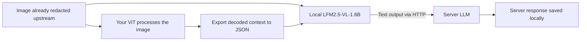

# ViT context → local LFM VLM → server LLM

This standalone script demonstrates the requested handoff:



Only this folder is used. The script does not import or modify `privacy_guard`, the dashboard, the extension, or `data_curation`. It does not run redaction or ViT itself: it imports the ViT's **already-computed output from an already-redacted image**.

## The main file

Open [pipeline.py](pipeline.py). The four stages are deliberately separate:

1. `load_vit_context()` imports decoded observations and the already-redacted screenshot.
2. `build_vlm_request()` combines that image and context into a multimodal request.
3. `run_lfm_vlm()` sends it to your local LFM2.5-VL-1.6B endpoint.
4. `send_to_server_llm()` sends the resulting **text** to your server LLM and reads its response.

`run_pipeline()` connects these stages and saves the result. The server request contains the local VLM's text and a fixed analysis instruction. The original screenshot, image path, and raw ViT JSON are not attached to that second request. The local VLM can still reproduce information in its answer; this script does not independently redact or certify its generated text.

## Run the presentation demo immediately

From the project root, using the existing environment:

```sh
.venv/bin/python vit_vlm_pipeline/pipeline.py demo --output-dir /tmp/vit-vlm-demo
```

Use a new directory each time. This creates a synthetic redacted screenshot and hand-authored ViT-style context, starts two mock model endpoints on loopback, performs both HTTP calls, verifies the text arrived, then shuts down the server.

**Demo mode does not run ViT, LFM, or a real server LLM.** Its responses explicitly say `DEMO FIXTURE`, and the saved mode is `demo_fixture`. It verifies wiring and data flow, not model quality.

Files produced:

```text
/tmp/vit-vlm-demo/
  sample_screen.png       Synthetic screenshot with the email area covered
  vit_context.json        Hand-authored fixture matching the import contract
  result.json             Local VLM output, delivery state, and server answer
  server_received/*.json  Exact chat request received by the mock server LLM
```

## Use real models

The script uses two separate OpenAI-compatible **chat-completions** endpoints. One runs LFM locally; the other runs your server LLM. These are protocol-compatible HTTP calls, not calls to an OpenAI service by default.

### 1. Start LFM2.5-VL-1.6B locally

With a current compatible `llama-server` installed:

```sh
llama-server \
  -hf LiquidAI/LFM2.5-VL-1.6B-GGUF:Q4_K_M \
  --alias LiquidAI/LFM2.5-VL-1.6B \
  --host 127.0.0.1 --port 8080 -c 4096
```

The model weights and vision projector are handled by the model server. Initial acquisition requires a download; this project does not include the weights. The official [LiquidAI GGUF model card](https://huggingface.co/LiquidAI/LFM2.5-VL-1.6B-GGUF) documents llama.cpp serving. [Liquid's deployment guide](https://docs.liquid.ai/deployment/on-device/llama-cpp) documents multimodal chat requests with image data URLs. If your runtime serves a different model alias, pass that alias through `--model`.

### 2. Export your ViT context

Start with [example_context.json](example_context.json). Replace the fixture with your real decoded ViT output and point `image_path` at the corresponding **redacted** image. Relative image paths resolve next to the context file.

Required fields: `screen_id`, `image_path`, and `image_redacted: true`, plus either `summary` or nonempty `elements`. Each element has a human-readable `label`, a pixel-coordinate `bbox` in `[left, top, right, bottom]` format, and optional confidence from 0 to 1. Right/bottom edges are exclusive. Optional width/height must match the image. `--image` can override the path.

The `image_redacted` field is your upstream declaration, not a privacy detector. The ViT summary/labels must also be suitable to pass to the local VLM. This adapter validates geometry and input structure, not the accuracy of ViT predictions.

**Embedding boundary:** decoded labels/boxes/summary are supplied as text context. Raw tensors such as `embeddings` or `hidden_states` are rejected. Arbitrary external ViT embeddings are not a supported drop-in input for the image/text chat API; direct feature integration needs compatible model internals and a trained projection. LFM2.5-VL-1.6B already has its own SigLIP2 vision encoder, described in the [official model card](https://huggingface.co/LiquidAI/LFM2.5-VL-1.6B).

### 3. Send local analysis to the server LLM

Set `VLM_API_KEY` if the local inference endpoint requires a bearer token and `SERVER_LLM_API_KEY` if the server LLM requires one. Credentials are read from environment variables, not source files, command arguments, or result JSON.

```sh
.venv/bin/python vit_vlm_pipeline/pipeline.py run \
  --context /absolute/path/to/vit_context.json \
  --vlm-url http://127.0.0.1:8080/v1/chat/completions \
  --server-url https://your-server.example/v1/chat/completions \
  --server-model YOUR_SERVER_MODEL_ID \
  --output /tmp/vit-vlm-real-result.json
```

Replace the placeholder server URL/model with your actual deployment. The server must accept `model`, `messages`, `max_tokens`, and the standard chat-completion response format. The script keeps a local copy of LFM output before forwarding it, then saves the server's answer. It does not execute the generated text as actions.

`--instruction` changes what you ask the local VLM to extract or explain. Choose an image/context size that fits your model server's configured context window. HTTP endpoints are configurable; if you change the local VLM URL to a remote host, that host receives the redacted screenshot and context.

## Failure behavior

- Existing local result files are rejected before network requests.
- Invalid images, out-of-bounds boxes, raw tensor input, empty model replies, truncated replies, and failed requests produce a nonzero exit.
- Failed local inference is never forwarded to the server LLM.
- If forwarding fails, successful local output remains in `result.json` with delivery `unconfirmed`. A timeout can occur after a server has accepted a request, so inspect that server before manually rerunning.
- No automatic POST retries or redirect following are used. HTTP bodies and API tokens are not printed in errors.
- The sample prompt requests non-sensitive analysis, but that prompt is not an enforceable privacy filter.

For a persistent **mock** service during a presentation:

```sh
.venv/bin/python vit_vlm_pipeline/pipeline.py demo-server \
  --port 9000 --storage /tmp/vit-vlm-received
```

It exposes `/local/v1/chat/completions` and `/server/v1/chat/completions` on loopback. Both return fixed fixtures; it is not a model host or production deployment. `SERVER_LLM_API_KEY`, if set, protects both mock routes.

## Separate installation and verification

The existing project environment already has the two client dependencies. To keep a new installation isolated:

```sh
python3 -m venv /tmp/vit-vlm-env
/tmp/vit-vlm-env/bin/python -m pip install -r vit_vlm_pipeline/requirements.txt
```

Python 3.10+ is required. Tests use a mocked HTTP transport and temporary image files:

```sh
.venv/bin/python -m unittest discover -s vit_vlm_pipeline -p 'test_*.py' -v
```

For your presentation, say: **“Our upstream ViT exports context from the redacted image. This standalone adapter gives that context and redacted image to local LFM2.5-VL-1.6B. It forwards the local model's text to the server LLM.”** When showing `demo`, state that the model responses are fixtures.

Verified in this checkout: eight isolated tests passed, lint passed, and the two-hop localhost HTTP demo saved the exact forwarded text at the mock server. Existing tracked project files were unchanged. Real LFM inference was not run: model weights/runtime and your server LLM endpoint still need to be configured.
